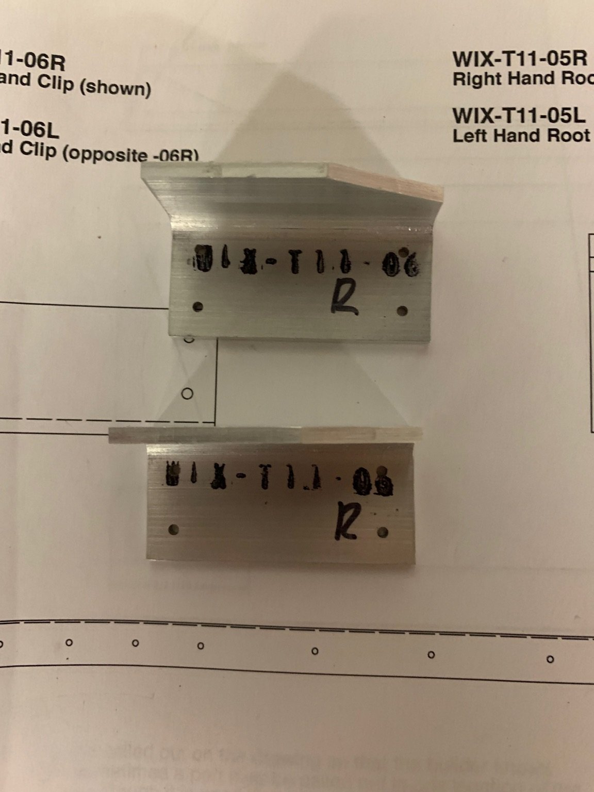
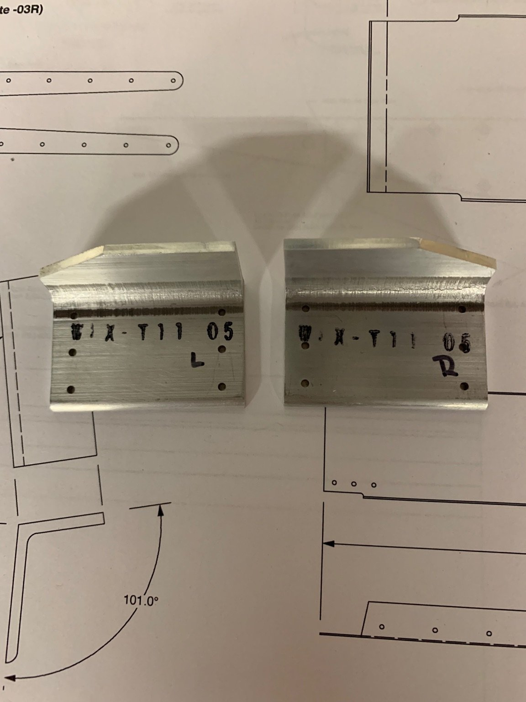
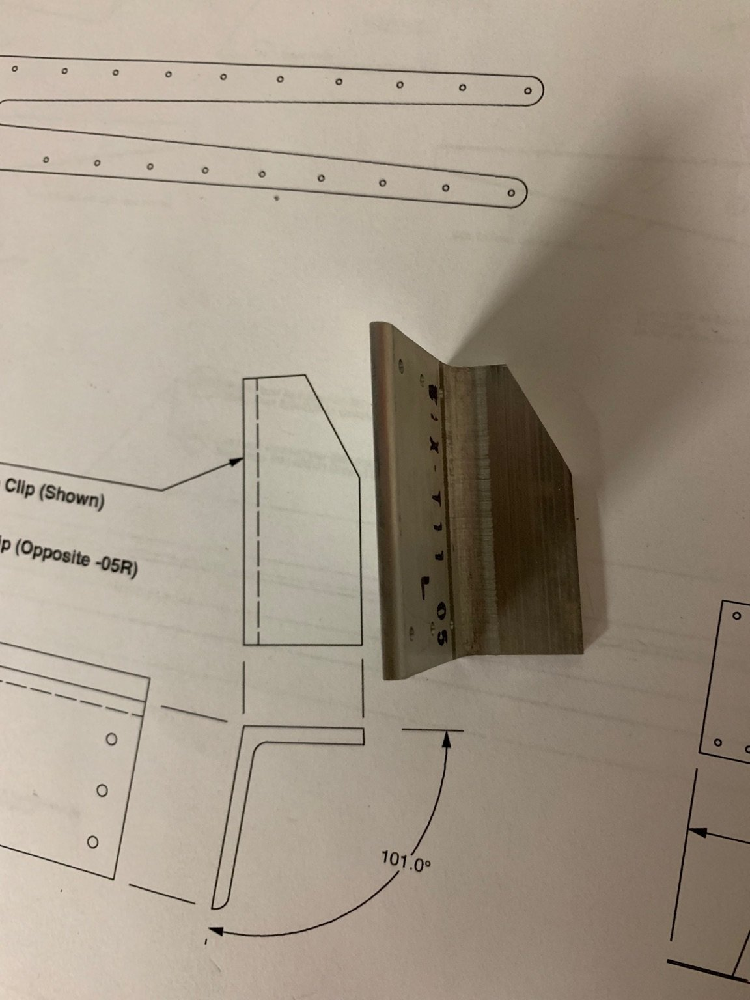
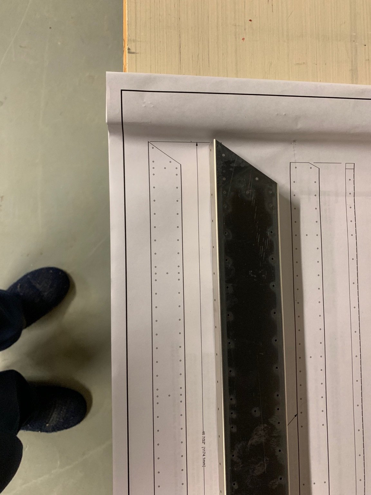
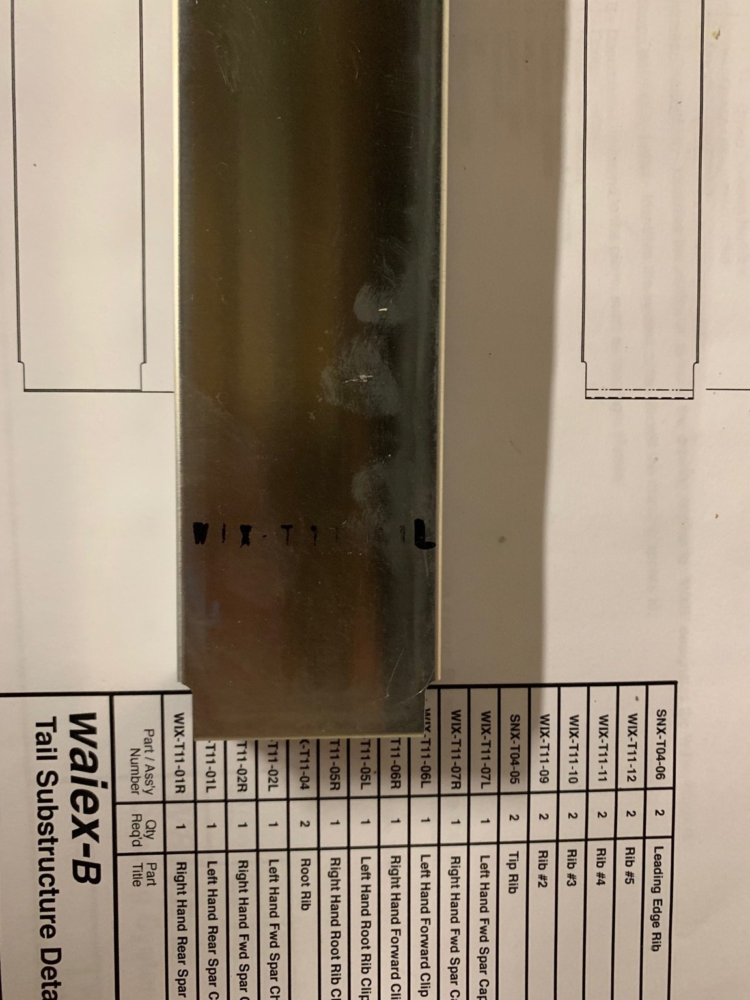
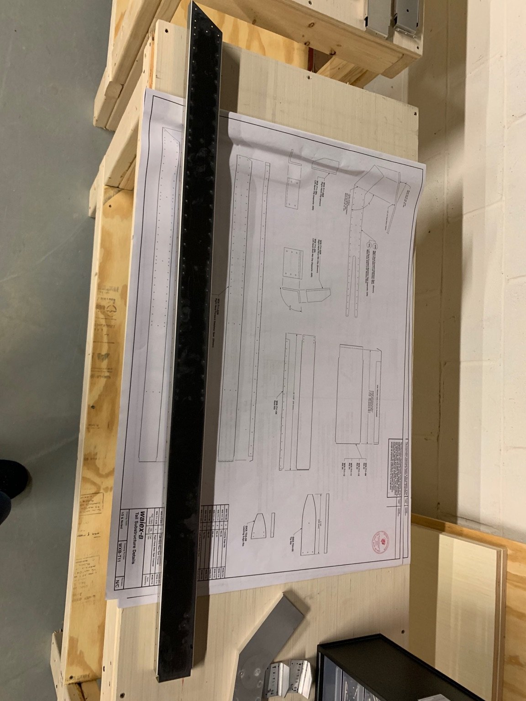
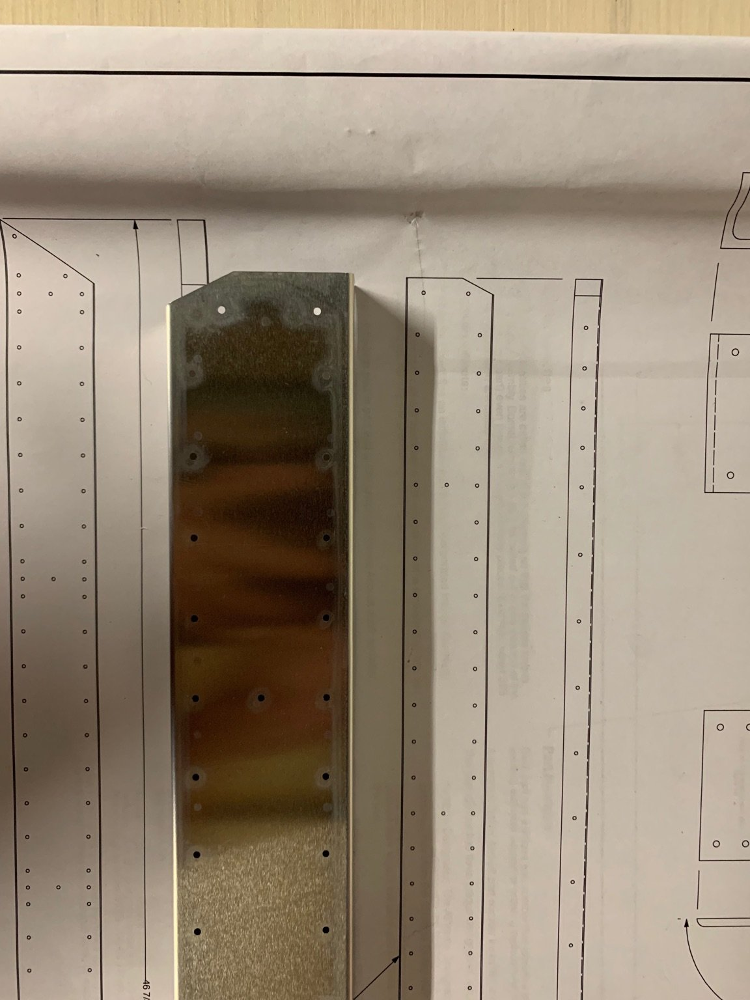
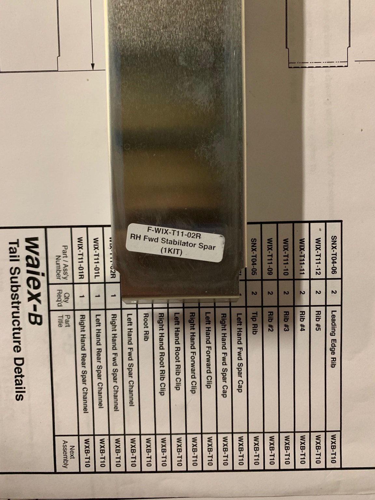
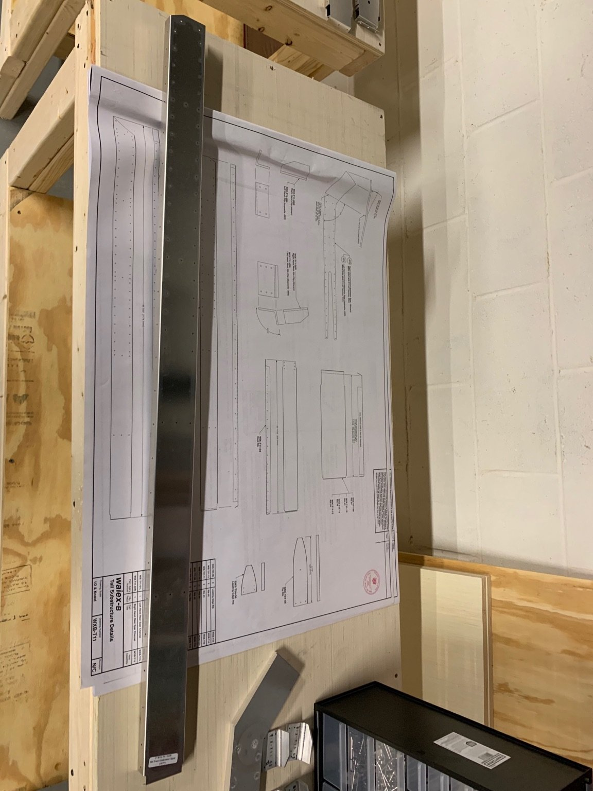

# Technical Support 2018-11-22

## Duplicate Parts

Received 2 `WIX-T11-06 R` but no `left` version.

## Incorrectly labelled left and right parts

### WIX-T11-05

It appears that the parts labelled `WIX-T11-05 R` and `L` are labelled incorrectly. Should `L` be `R`?

The plans indicate that `R` is shown and `L` would be opposite. In these pictures I have the `left` part laid out next to the drawing, showing that it is matching the `right` part on the drawing.

### WIX-T11-01

It appears that the parts labelled `WIX-T11-01 R` and `L` are labelled incorrectly. Should `L` be `R`?

The plans indicate that the `right` side is shown. In the pictures below I have the `left` part laid out above the drawing, showing that it is matching the `right` part on the drawing.

### WIX-T11-02

It appears that the parts labelled `WIX-T11-02 R` and `L` are labelled incorrectly. Should `L` be `R`?

the plans indicate that the `right` side is shown. In the pictures below I have the `right` part laid out below the drawing, showing that it is opposite the `right` part on the drawing.

## Questions

1. Are the parts incorrectly labelled?
1. Are the drawings incorrectly labelled?
1. How do I get a replacement `WIX-T11-06 L`?

## Resolution

* Learn to read the plans.
* Replacement part sent.
